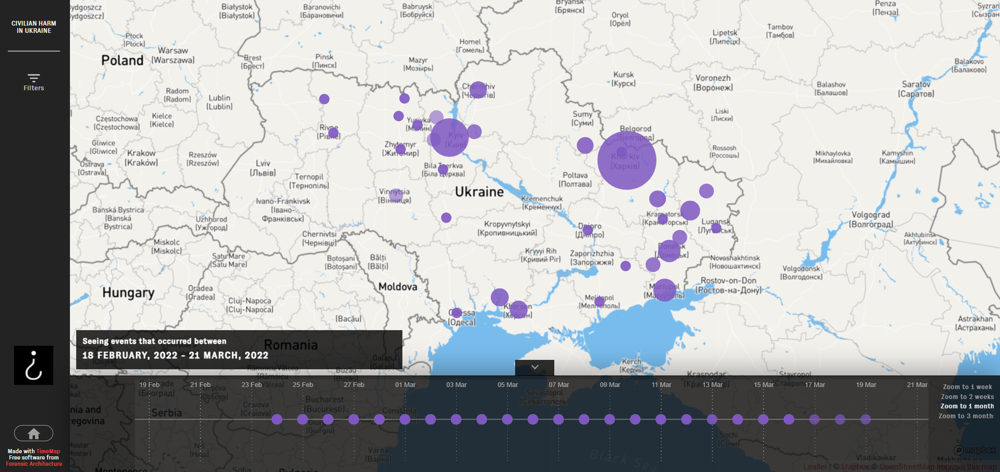

<h1 align="center">Civilian Harm in Ukraine TimeMap</h1>

<h2 align="center">Visit <a href="https://ukraine.bellingcat.com/">ukraine.bellingcat.com</a>.</h2>

<h3 align="center">
Read Bellingcat's article about this project in 
<a href="https://www.bellingcat.com/news/2022/03/17/hospitals-bombed-and-apartments-destroyed-mapping-incidents-of-civilian-harm-in-ukraine/">English (UK)</a>,
<a href="https://ru.bellingcat.com/novosti/2022/03/18/hospitals-bombed-and-apartments-destroyed-mapping-incidents-of-civilian-harm-in-ukraine-ru/">Русский (Россия)</a>
</h3>

<strong>
	TimeMap is a tool for exploration, monitoring and classification of incidents in time and space, originally forked from <a href="https://github.com/forensic-architecture/timemap">forensic-architecture/timemap</a>.
</strong>

 
 

## Development
* `npm install` to setup
* adjust any local configs in [config.js](config.js)
* `CONFIG=config.js npm run dev` or `npm run dev` if the file is named config.js
* For more info visit the [original repo](https://github.com/forensic-architecture/timemap)

## Contributing
Please check our [issues page](https://github.com/bellingcat/ukraine-timemap/issues) for desired contributions, and feel free to suggest your own. 

## Configurations

Documentation of <a href="config.js">config.js</a> 

* `SERVER_ROOT` - points to the API base address
* `XXXX_EXT` - points to the respective JSONs of the data, for events, sources, and associations
* `MAPBOX_TOKEN` - used to load the custom styles
* `DATE_FMT` and `TIME_FMT` - how to consume the events' date/time from the API
* `store.app.map` - configures the initial map view and the UX limits
* `store.app.cluster` - configures how clusters/bubbles are grouped into larger clusters, larger `radius` means bigger cluster bubbles
* `store.app.timeline` - configure timeline ranges, zoom level options, and default range
* `store.app.intro` - the intro panel that shows on start
* `store.app.cover` - configuration for the full page cover, the `description` is a list of markdown entities, can also contain html
* `store.ui.colors` and `store.ui.maxNumOfColors` are applied to filters, as they are selected

Easiest way to deploy the static files is through 
* `nvm use 16`
* `npm run build` (rather: `CI=false npm run build`)
* copy the files to your server, for example to `/var/www/html`

